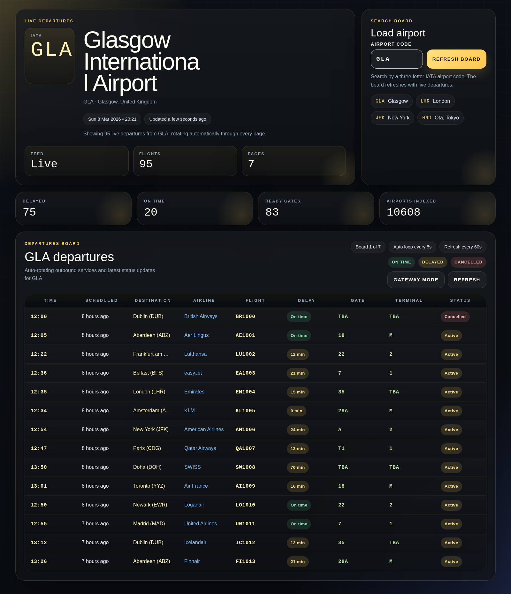
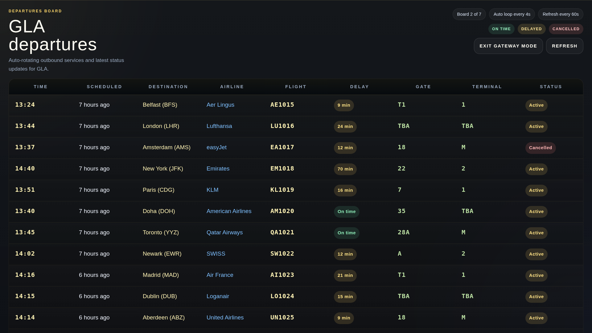

# vue-flightboard

A Vue 2 departures board that loads live airport timetable data, rotates through pages automatically, and can switch into a full-screen gateway board mode.

## Screenshots

### Live board dashboard



### Gateway mode



## Features

- Live departures lookup by IATA airport code
- Airport suggestions and quick airport chips
- Auto-refreshing board data
- Auto-looping board pages without visible pagination controls
- Full-screen gateway mode with split-flap style row transitions
- Unit coverage for airport lookup and board formatting helpers

## Setup

Install dependencies:

```bash
npm install
```

Create `.env` with an Aviation Edge API key:

```bash
VUE_APP_API_KEY=your_api_key_here
```

## Scripts

```bash
npm run serve
npm run build
npm run lint
npm run test:unit
npm run test:e2e
```

The project uses Vue CLI 4, so the npm scripts already include the OpenSSL legacy flag needed for Node 20 builds.

## GitHub Pages

Run `npm run deploy` to build the app and publish the generated `dist` output to the root of the `gh-pages` branch.

## Current UI

- The default screen opens a live departures board for `GLA`
- `Gateway mode` expands the board to a proper full-page display
- The table no longer exposes manual pagination; it loops automatically through every page of flights

## Notes

- The current Sass layer still emits deprecation warnings because the older shared partials rely on `@import`, slash division, and legacy color helpers.
- Production builds complete successfully despite those warnings.
